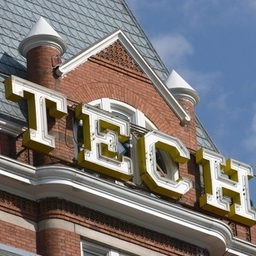
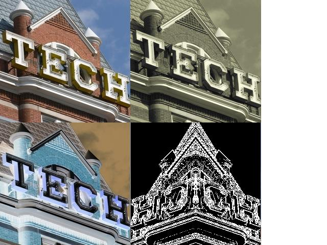

Unit 6: Media Computation
==============
Collage Lab

The goal of this lab was for to apply creatively the filters and transformations that I developed to create a collage.
I wrote a cropAndCopy method that copies a portion of a picture onto a new picture, a mirrorVerticalRightToLeft method that mirrors an image vertically from left to right. I also wrote grayscale, sepia, negate, and edge detection filters.

Initial Picture:

Final Picture:

